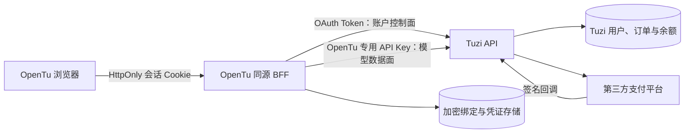
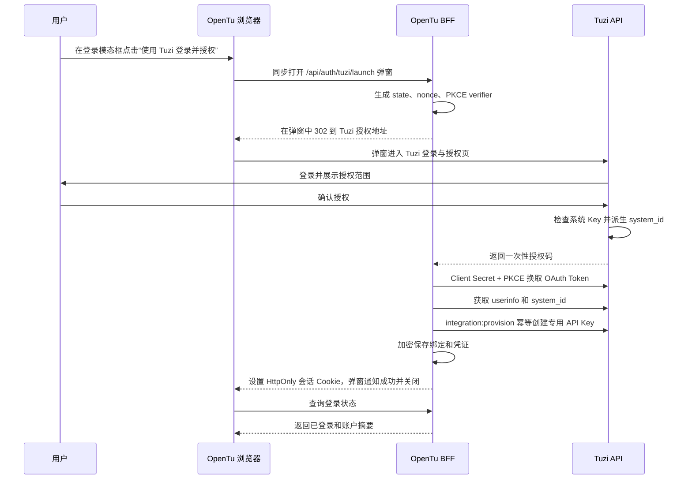
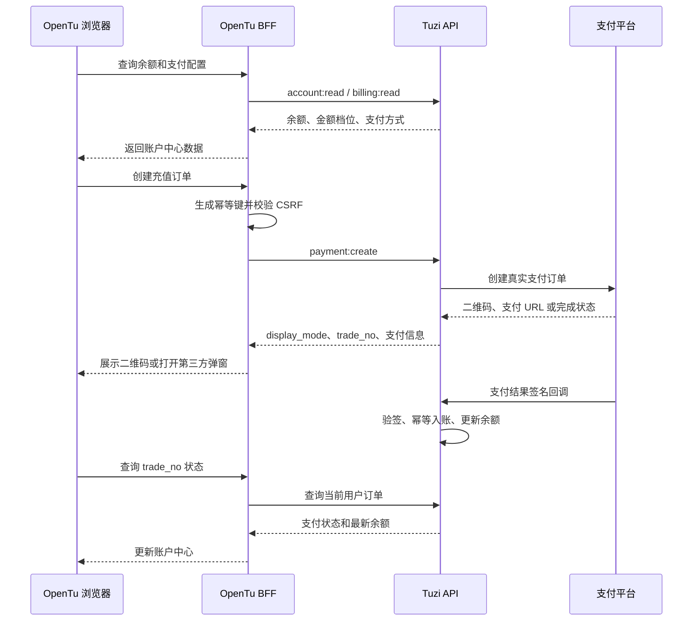

# OpenTu × Tuzi API 安全联动与账户中心设计

> 状态：需求对齐稿，尚未进入实现
>
> 日期：2026-08-14
> 涉及项目：OpenTu、Tuzi API

## 1. 背景

OpenTu 当前主要是静态 PWA，模型供应商凭证会进入浏览器配置和 Service Worker。新需求要求 OpenTu 使用 Tuzi 账号登录，并由 Tuzi API 作为账户、计费、充值和模型调用后台，同时保证 Tuzi 敏感凭证不进入浏览器缓存。

本设计采用 OAuth 2.1 授权码模式、PKCE、OpenTu 同源 BFF 和 Tuzi 专用子凭证，避免自研浏览器加密协议，也避免把高权限系统 Key 直接交给 OpenTu。

## 2. 已确认需求

1. OpenTu 不建设独立用户名和密码体系，直接使用 Tuzi 账号登录。
2. 登录时 OpenTu 主页面不得整页跳转；首次登录通过 OpenTu 登录模态框和独立授权弹窗完成。
3. 每位用户消耗自己 Tuzi 账号的余额和额度。
4. OpenTu 与 Tuzi 的绑定关系由服务端长期保存，直到用户主动解除。
5. Tuzi 的系统身份必须参与 OpenTu 绑定，不能完全绕开。
6. 首次授权时若系统 Key 不存在，由 Tuzi 在授权弹窗内经用户确认后建立，原始值不返回 OpenTu。
7. 浏览器不得保存 Tuzi 系统 Key、OAuth Token 或模型 API Key。
8. OpenTu 内提供原生账户中心，可查看余额、充值和订单状态，不跳转到 Tuzi 控制台页面。
9. 支付宝、微信等二维码支付直接在 OpenTu 内展示。
10. Stripe、3DS 等必须使用支付方页面的场景，允许从 OpenTu 打开第三方支付弹窗，但保留 OpenTu 主页面。
11. 支付回调、签名验证、订单入账和余额更新统一由 Tuzi API 负责。
12. 文件上传、模型响应和 SSE 数据必须流式转发，不能整包缓存在 BFF 内存中。

## 3. 术语

| 名称 | 定义 |
| --- | --- |
| 系统 Key | Tuzi 用户的高权限系统访问令牌，只允许在 Tuzi 服务端内部使用 |
| `system_id` | 由系统 Key 安全派生的 OpenTu 专用、不透明绑定标识，不具备独立鉴权能力 |
| OAuth Token | OpenTu BFF 调用 Tuzi 账户、余额、充值和订单接口的短期授权凭证 |
| OpenTu 专用 API Key | 仅供 OpenTu 模型调用的数据面凭证，由 Tuzi 创建并管理 |
| BFF | 部署在 OpenTu 同源域名下的服务端网关，负责会话、凭证托管和流式代理 |

## 4. 设计目标

- 系统 Key 真正参与 OpenTu 身份绑定和吊销链。
- 原始系统 Key 永不离开 Tuzi 服务端。
- OpenTu 浏览器只能接触不可读的会话 Cookie 和非敏感展示数据。
- 账户操作和模型调用使用不同凭证，权限互不扩大。
- OpenTu 只能管理由自己创建的专用 API Key，不能读取或修改用户其他 Key。
- 系统 Key 轮换、用户禁用、解除绑定时，可以立即切断 OpenTu 权限。
- 充值流程不依赖 Tuzi 控制台页面，支付状态以 Tuzi 服务端为准。

## 5. 非目标

- 不把系统 Key 直接保存到 OpenTu BFF。
- 不把系统 Key、OAuth Token 或 API Key 传给浏览器。
- 不通过 Key 后缀表达 OpenTu 归属。
- 不使用 iframe 嵌入 Tuzi 控制台或第三方支付后台。
- 不让 `system_id` 充当密码、Bearer Token 或支付用户选择参数。
- 不在第一期复制 Tuzi 的管理员后台和账号安全设置。

## 6. 总体架构



### 6.1 控制面

OAuth Token 用于：

- 获取 Tuzi 用户身份；
- 查询余额和额度；
- 查询充值配置与订单；
- 创建支付订单；
- 查询支付状态；
- 创建、轮换和撤销 OpenTu 专用 API Key。

### 6.2 数据面

OpenTu 专用 API Key 仅用于：

- 文本、图片、视频和音频模型调用；
- 异步任务提交和结果查询；
- 与模型调用直接相关的文件和流式接口。

系统 Key 不直接用于控制面或数据面请求，只作为 Tuzi 内部的根凭证参与绑定标识派生和吊销。

## 7. 系统 Key 与 `system_id`

### 7.1 派生方式

Tuzi 服务端使用独立密钥派生 OpenTu 专用系统 ID：

```text
system_id =
  "tuzi_sid_v1_" + Base64URL(
    HMAC-SHA256(
      OPENTU_BINDING_SECRET,
      user_id || "\0" || client_id || "\0" || SHA256(system_key)
    )
  )
```

要求：

- `OPENTU_BINDING_SECRET` 只能存放在 Tuzi 服务端密钥管理系统或受控环境变量中。
- 不截断 HMAC 输出，使用无填充 Base64URL 编码。
- `client_id` 固定为已登记的 OpenTu OAuth Client ID。
- 原始系统 Key 只在 Tuzi 进程内短暂参与计算，不写入日志或新增副本。
- `system_id` 可作为数据库唯一标识保存，但不能作为鉴权凭证使用。

### 7.2 系统 Key 不存在

首次授权时，如果用户尚未生成系统 Key：

1. Tuzi 授权页明确告知将创建系统身份并授权给 OpenTu。
2. 用户确认后，Tuzi 服务端通过幂等接口生成系统 Key。
3. 生成接口不把原始系统 Key 返回给 OpenTu 页面或 BFF。
4. Tuzi 随后派生 `system_id` 并继续授权流程。

不得调用现有具有重置语义的接口盲目覆盖用户已有系统 Key。

### 7.3 系统 Key 轮换

系统 Key 轮换是根凭证安全事件，必须：

1. 使旧 `system_id` 对应的 OpenTu 绑定进入 `reauthorization_required` 状态。
2. 撤销相关 OAuth Token Family。
3. 禁用或删除相关 OpenTu 专用 API Key。
4. 清除 OpenTu BFF 中对应的加密凭证。
5. 要求用户重新完成 Tuzi 授权。

除系统 Key 轮换、用户禁用和管理员安全处置外，绑定关系持续有效，直到用户主动解除。

## 8. 登录与首次绑定流程

### 8.1 登录交互约束

OpenTu 登录采用“主页面模态框 + 独立授权弹窗”，主页面始终保留：

1. 未登录用户进入 OpenTu 时，主页面展示登录模态框。
2. 用户主动点击“使用 Tuzi 登录并授权”按钮。
3. 点击事件同步执行 `window.open('/api/auth/tuzi/launch', ...)`，先打开 OpenTu 同源 BFF 地址，避免被浏览器判定为异步弹窗并拦截。
4. BFF 在弹窗请求中创建 `state`、`nonce` 和 PKCE 事务，再以 `302` 将弹窗导航到 Tuzi 授权页。
5. 用户未登录 Tuzi 时，在弹窗内完成 Tuzi 登录；已登录时直接显示授权确认。
6. 若系统 Key 不存在，Tuzi 授权页明确展示“建立系统身份并授权 OpenTu”，用户确认后由 Tuzi 服务端建立系统 Key。
7. 原始系统 Key 不显示、不复制，也不返回给 OpenTu BFF 或浏览器。
8. 授权完成后，回调仍在弹窗中由 OpenTu BFF 处理，成功页自动通知主窗口并关闭。
9. OpenTu 主窗口重新向 BFF 查询会话和绑定状态，验证成功后关闭登录模态框并进入应用。

弹窗通知只能包含事务 ID 和成功/失败状态；不得包含 `system_id`、授权码、OAuth Token、系统 Key 或专用 API Key。主窗口必须校验消息的精确 `origin` 和弹窗 `source`，并以 BFF 查询结果作为最终依据。

### 8.2 服务端授权流程



安全要求：

- 授权码有效期不超过 5 分钟且只能兑换一次。
- 必须使用 PKCE S256、随机 `state` 和 `nonce`。
- BFF 回调成功后立即 `303` 到无查询参数页面。
- Nginx 和应用日志不得记录授权码查询参数。
- 弹窗只传递“成功/失败”状态，不通过 `postMessage` 传递任何凭证。
- 主窗口从 BFF 重新查询登录状态，不信任弹窗提交的身份数据。
- 用户关闭或拒绝授权时，OpenTu 主页面保持原状态并允许重新发起登录。
- 系统 Key 建立成功但后续授权失败时，不得生成专用 API Key 或有效 OpenTu 绑定。

## 9. OpenTu 专用 API Key

### 9.1 不使用后缀

现有标准 API Key 的 `-后缀` 已被 Tuzi 用作“指定渠道”语义。使用 `sk-原Key-opentu` 会导致普通用户鉴权失败，也会造成只读接口和模型接口解析不一致。

因此：

- Key 保持高熵随机值，不增加 `-opentu` 后缀。
- OpenTu 归属通过数据库元数据表达。
- 自定义 Header 只允许用于观测，不得作为归属鉴权依据。

### 9.2 建议元数据

| 字段 | 示例 | 作用 |
| --- | --- | --- |
| `name` | `OpenTu 专用` | 用户可识别名称 |
| `managed_by_client_id` | `opentu` | 限制管理主体 |
| `purpose` | `model_invoke` | 限制用途 |
| `binding_system_id` | `tuzi_sid_v1_...` | 关联系统身份 |
| `status` | `enabled` | 生命周期状态 |

### 9.3 `integration:provision` 权限

该权限只能：

- 幂等创建当前用户、当前 OAuth Client 的专用 Key；
- 轮换该 Client 自己管理的专用 Key；
- 禁用或删除该 Client 自己管理的专用 Key；
- 返回一次新创建或新轮换的完整 Key。

该权限不能：

- 查看或修改用户手工创建的 Key；
- 获取其他 Client 创建的 Key；
- 读取任意完整 Key；
- 修改系统 Key；
- 管理管理员或渠道配置。

完整 Key 只在创建或轮换响应中返回一次，响应必须设置 `Cache-Control: private, no-store`。

## 10. OpenTu BFF

### 10.1 职责

- 管理 OpenTu 登录会话；
- 保存 Tuzi `system_id` 和长期绑定状态；
- 加密保存 OAuth Refresh Token 和 OpenTu 专用 API Key；
- 自动轮换 OAuth Access Token；
- 代理账户、余额、充值和订单请求；
- 流式代理模型请求、文件上传和响应；
- 执行 CSRF、限流、幂等和审计控制。

### 10.2 浏览器会话

浏览器只保存随机会话 Cookie：

```text
Set-Cookie: __Host-opentu_session=<opaque-id>;
            Path=/;
            Secure;
            HttpOnly;
            SameSite=Lax
```

要求：

- Cookie 不包含 Tuzi 用户 ID、`system_id` 或任何 Token。
- 服务端只保存会话 ID 的哈希。
- 登录、支付创建、解除绑定等写操作需要 CSRF 防护。
- 会话支持主动注销和服务端立即失效。

### 10.3 凭证存储

- 使用 AES-256-GCM 信封加密。
- 每条绑定使用独立随机 nonce。
- 主密钥来自 KMS 或受控 Secret，不写入数据库和代码仓库。
- 日志、监控、异常追踪和备份不得包含明文 Token。
- 不使用无限增长的明文内存缓存。

## 11. OAuth 权限范围

| Scope | 用途 |
| --- | --- |
| `profile:read` | 获取当前 Tuzi 用户基本身份 |
| `account:read` | 获取余额、额度和账户状态 |
| `billing:read` | 获取充值记录、订单状态和消费记录 |
| `payment:create` | 创建当前用户自己的支付订单并查询结果 |
| `integration:provision` | 管理 OpenTu 专用 API Key |
| `offline_access` | 允许 BFF 安全续期 OAuth 会话 |

明确禁止授予：

- `token:write`
- `token:reveal`
- 管理员权限
- 渠道管理权限
- 系统设置权限

支付接口必须从已验证 OAuth Token 上下文取得用户 ID，不能接受浏览器传入的 `user_id` 或 `system_id` 作为付款主体。

## 12. OpenTu 原生账户中心

### 12.1 建议一期范围

- Tuzi 登录与退出；
- 当前余额、额度和账户状态；
- 充值金额和支付方式选择；
- 二维码或第三方支付弹窗；
- 支付订单状态；
- 充值记录；
- 消费记录；
- OpenTu 专用 Key 状态；
- 解除绑定。

### 12.2 后续范围

- 套餐与订阅；
- 发票；
- 企业付款；
- 兑换码；
- 更详细的用量分析。

密码、邮箱绑定、Passkey、2FA、系统 Key 展示和管理员功能建议继续由 Tuzi 官方安全页面负责，不在第一期复制。

## 13. 充值与支付流程



### 13.1 页面不跳转要求

- OpenTu 不跳转到 Tuzi 控制台充值页。
- 二维码支付在 OpenTu 模态窗口内完成。
- 必须使用第三方托管收银台时，从用户点击事件直接打开支付方弹窗，避免浏览器拦截。
- 支付成功和取消地址由 Tuzi 根据登记的 OpenTu Client 配置生成，不接受任意回跳地址。
- 支付完成后弹窗可关闭，OpenTu 主页面继续查询订单并刷新余额。
- 不在 iframe 中加载支付页面，避免 CSP、点击劫持和支付合规问题。

### 13.2 支付安全

- 每次创建订单必须携带 8 至 128 字节的幂等键。
- 相同幂等键和相同请求返回同一订单；参数冲突必须拒绝。
- 金额、手续费、币种和实际到账额度由 Tuzi 服务端计算。
- OpenTu 不得提交最终支付金额或到账额度作为可信值。
- 支付回调只由 Tuzi 接收，并验证签名、金额、币种、订单状态和网关配置版本。
- 订单查询必须校验订单属于当前 OAuth 用户。
- 查询使用退避策略，避免固定高频轮询。

## 14. 浏览器不缓存要求

以下数据禁止进入浏览器持久化存储：

- 系统 Key；
- OAuth Authorization Code；
- OAuth Access Token；
- OAuth Refresh Token；
- OpenTu 专用 API Key；
- BFF 数据库加密主密钥。

禁止位置包括：

- URL 查询参数和片段；
- LocalStorage；
- SessionStorage；
- IndexedDB；
- Cache Storage；
- Service Worker 配置和日志；
- 剪贴板；
- 前端埋点和错误上报。

敏感接口统一返回：

```http
Cache-Control: private, no-store, max-age=0
Pragma: no-cache
Expires: 0
Referrer-Policy: no-referrer
```

Service Worker 必须直接绕过 `/api/auth/*`、`/api/account/*`、`/api/billing/*` 和模型代理接口，不缓存请求或响应。

## 15. 高并发与文件处理要求

- BFF 使用流式请求和响应转发，不调用整包 `ReadAll`。
- 多文件请求按顺序或受控并发处理，必须有单文件、总文件和文本字段上限。
- 客户端断开时立即取消上游请求。
- SSE、WebSocket 和长轮询必须设置连接上限、空闲超时和心跳。
- 凭证解密结果只在单次请求生命周期中使用并尽快释放引用。
- 数据库和 Redis 使用有界连接池。
- 日志仅记录请求 ID、用户内部 ID、订单号和脱敏 Token 提示，不记录请求正文中的凭证。

## 16. 解绑与异常处理

### 16.1 主动解除绑定

1. OpenTu 验证当前会话和 CSRF。
2. BFF 请求 Tuzi 撤销 OAuth Token Family。
3. Tuzi 删除或禁用 OpenTu 专用 API Key。
4. BFF 删除加密凭证和绑定状态。
5. BFF 清除浏览器会话 Cookie。

### 16.2 用户被禁用

- Tuzi 的 OAuth 和模型接口立即拒绝请求。
- OpenTu 清除本地会话并显示账号不可用状态。
- 不允许继续使用已缓存的账户摘要或支付状态。

### 16.3 专用 API Key 被用户手动删除

- BFF 收到模型鉴权失败后查询绑定状态。
- 若 OAuth 授权仍有效，可经用户确认重新执行 `integration:provision`。
- 不静默创建无限数量的新 Key。

### 16.4 OAuth Refresh Token 重放

- Tuzi 撤销整个 Token Family。
- BFF 清除对应绑定凭证并要求重新授权。
- 记录高优先级安全审计事件，但不记录 Token 明文。

## 17. 数据模型建议

### 17.1 Tuzi API

在现有 Token 结构上增加必要元数据，不新建重复的模型调用 Token 实体：

```text
managed_by_client_id
purpose
binding_system_id
```

OAuth 授权记录需要能够关联：

```text
user_id
client_id
system_id
token_family_id
revoked_at
```

### 17.2 OpenTu BFF

绑定记录至少包含：

```text
binding_id
system_id
tuzi_user_id
oauth_refresh_token_ciphertext
api_token_id
api_key_ciphertext
status
created_at
updated_at
last_used_at
```

数据库中不保存原始系统 Key。`system_id` 仅作绑定索引，不作鉴权条件。

## 18. 审计事件

至少记录：

- OpenTu 首次授权成功或失败；
- 系统 Key 缺失、创建和轮换；
- `system_id` 绑定建立、失效和解除；
- 专用 API Key 创建、轮换、禁用和删除；
- OAuth Refresh Token 重放；
- 支付订单创建、查询、回调和入账；
- 越权访问其他用户订单或 Token 的拒绝事件。

所有标识应脱敏，禁止记录系统 Key、OAuth Token、完整 API Key、支付签名和支付平台密钥。

## 19. 验收标准

### 19.1 登录与绑定

- [ ] 未登录用户只能通过 Tuzi 登录进入 OpenTu。
- [ ] 登录全过程不刷新或跳离 OpenTu 主页面。
- [ ] 登录弹窗只能由用户点击直接打开，弹窗被拦截时提供明确的重新打开操作。
- [ ] Tuzi 登录、系统 Key 建立和授权全部在独立弹窗内完成。
- [ ] 原始系统 Key 不出现在弹窗 DOM、网络响应、主窗口或 BFF 存储中。
- [ ] 首次授权后产生唯一 `system_id` 和唯一 OpenTu 专用 API Key。
- [ ] 重复登录不会重复创建绑定或 API Key。
- [ ] 浏览器开发者工具中不存在 Tuzi 敏感凭证。
- [ ] 系统 Key 轮换后旧绑定立即失效并要求重新授权。
- [ ] 用户主动解绑后 OAuth、专用 Key 和 OpenTu 会话全部失效。

### 19.2 权限

- [ ] OpenTu 不能列出、查看或修改用户其他 API Key。
- [ ] `system_id` 不能单独访问账户、支付或模型接口。
- [ ] 支付接口只能操作 OAuth 当前用户自己的订单。
- [ ] OpenTu 专用 API Key 只能用于模型数据面。

### 19.3 充值

- [ ] OpenTu 可原生展示余额、金额档位和支付方式。
- [ ] 二维码支付不离开 OpenTu 页面。
- [ ] 第三方托管支付使用弹窗，不跳转 Tuzi 控制台。
- [ ] 支付回调只由 Tuzi 处理并完成幂等入账。
- [ ] 订单成功后 OpenTu 自动刷新余额。
- [ ] 重复提交不会创建重复订单或重复入账。

### 19.4 性能与缓存

- [ ] 文件上传和模型响应全程流式处理。
- [ ] Service Worker 不缓存认证、账户、支付和模型代理请求。
- [ ] 所有敏感响应均包含 `no-store`。
- [ ] 日志和错误上报不包含敏感凭证。

## 20. 实施顺序建议

1. 分别在 OpenTu 和 Tuzi API 创建 OpenSpec 变更提案及安全设计。
2. Tuzi API 增加 OAuth Scope、`system_id` 派生和 `integration:provision`。
3. Tuzi API 增加专用 Key 元数据、轮换和吊销链。
4. OpenTu 增加同源 BFF、服务端会话和加密凭证存储。
5. OpenTu 接入 Tuzi 登录和首次绑定。
6. 将模型调用切换到 BFF 流式代理。
7. 接入账户摘要、余额和消费记录。
8. 接入充值配置、支付创建、二维码/弹窗和订单查询。
9. 完成系统 Key 轮换、解绑、Token 重放和支付幂等测试。
10. 完成安全审计、压力测试和灰度发布。

实现必须经过 OpenSpec 提案审核后开始。
