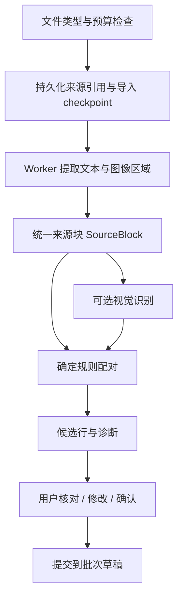
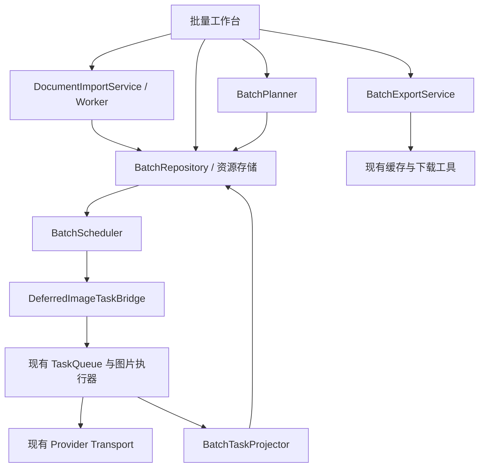
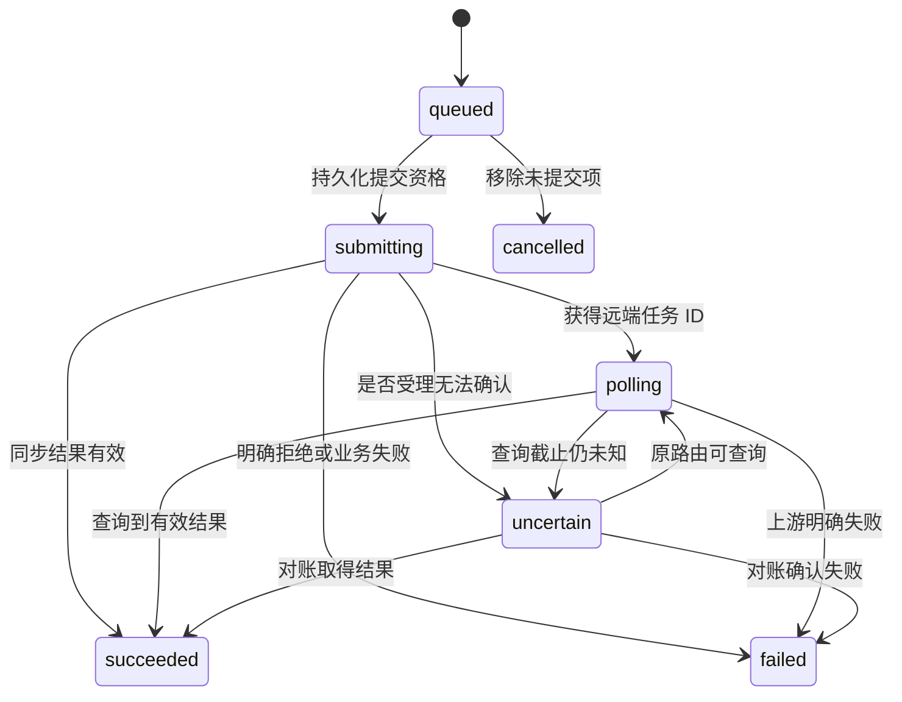

# 文档驱动的批量生图工作台：技术方案

- 日期：2026-09-26
- 状态：待评审，未实施
- 变更：`add-document-batch-image-generation`
- 代码核查基线：`opentu-2` / `dev/fix-download-toast` / `0b0974fd`

本文件为批准的设计依据。2026-09-26 已在 opentu-4 实施首版，实际完成范围与未完成项以 tasks.md、docs/document-batch-generation.md 和 QA 记录为准；以下设计目标不等于全部已实现。配套文件：[提案](./proposal.md)、[实施任务](./tasks.md)、[行为规范](./specs/document-batch-generation/spec.md)。

## 1. 最终效果与范围

在顶部导航增加「批量生成」，进入独立工作台。用户上传 Excel 或 PDF 后，系统把提示词和参考图整理为可编辑的任务行；用户核对并勾选后才生成。异步结果回填到对应行，用户可以选择其中的图片批量下载。


### 1.1 首版包含

| 能力 | 首版行为 |
| --- | --- |
| Excel | XLSX 多工作表选择、表头映射、文本/图片 URL、标准绘图内嵌图片；XLS 只支持文本与链接并提示转存 XLSX |
| PDF | 文本型 PDF 本地解析、图像区域与提示词配对、原页预览；扫描件可选视觉模型识别，也可手动框选和补录 |
| 行编辑 | 提示词、名称、参考图增删/替换/排序、模型、比例、分辨率、数量、模型支持的其他参数；支持新增、复制、拆分、合并和移除 |
| 批量操作 | 稳定行 ID 勾选、按状态筛选、明确范围的全选、批量修改、生成选中项、暂停/继续提交、移除尚未提交项 |
| 历史 | 本地保存批次、来源、草稿修订、每轮输入快照、任务关联和多图结果 |
| 结果 | 单行、多轮、多张结果；独立勾选图片、下载选中结果、下载失败项重试 |

首版的「自动识别」是提出可核对的配对候选，不承诺任意排版完全正确。PDF 中无法恢复的原始嵌入图片可由页面区域裁图替代，必须展示来源和裁图属性。

### 1.2 不包含

- 无人值守的服务端批次调度、关闭浏览器后继续提交、跨设备同步、多人同时编辑。
- 任意 Office 格式、执行宏或公式、加密文档解密、保证 PDF 原图无损还原。
- 未经用户操作的提示词润色、缺失提示词自动创作、导入后自动付费生图。
- 用一个全新 HTTP 客户端替换既有图片执行器，或将所有 Tuzi 模型强制切到同一种异步接口。

## 2. 已核实基础与接入边界

| 现有能力 | 核查结论 | 处理方式 |
| --- | --- | --- |
| [batch-image-generation.tsx](../../../packages/drawnix/src/components/ttd-dialog/batch-image-generation.tsx) | 已有表格、行参数、Excel 导入、批量提交/下载；导入只读首张表、参考图只解析单元格 URL；行选择使用数组下标 | 抽取小型纯函数与可复用控件；新数据用稳定 ID，不继续扩张整个大组件 |
| 同一组件的 `executeSubmit` | 数量拆成多次图片任务，默认 `autoInsertToCanvas: true` | 新入口采用相同任务体系，显式关闭自动插入；旧入口不改行为 |
| [task-queue-service.ts](../../../packages/drawnix/src/services/task-queue-service.ts) | `createTask` 立即进入执行，持久化调用不可由调用方等待 | 增加可等待、幂等的延迟创建/启动接口；不能一次调用数百次 `createTask` 充当限流 |
| [task-storage-writer.ts](../../../packages/drawnix/src/services/media-executor/task-storage-writer.ts) | 已有事务完成确认、按 Request ID 条件写入；当前创建方法最终使用 `put` | 复用事务思想，补充条件创建/提交门闩；不能把当前 `createTask` 当成 create-if-absent |
| [image-api.ts](../../../packages/drawnix/src/services/media-api/image-api.ts)、[async-image-api-service.ts](../../../packages/drawnix/src/services/async-image-api-service.ts) | 已有同步/异步提交、远端 ID 回调及恢复查询；后一模块的本地路径包括 `/videos` | 以实际模型 binding 选择路径；这些路径只是本地实现证据，不是所有模型的官方协议 |
| [image-generation-recovery-service.ts](../../../packages/drawnix/src/services/image-generation-recovery-service.ts) | 可信 Tuzi 同步图片可按 Request ID 查询，已有并发/退避/原路由校验 | 直接复用；请求 ID 不等同于上游保证幂等 POST |
| [app-database.ts](../../../packages/drawnix/src/services/app-database.ts)、[kv-storage-service.ts](../../../packages/drawnix/src/services/kv-storage-service.ts) | 主线程任务库与通用 KV 是不同存储；通用 KV 不提供跨实体事务接口 | 新批次建立独立事务存储；通过先写计划与稳定任务 ID 连接现有任务库，不假设跨库事务 |
| [pptx-import](../../../packages/drawnix/src/services/pptx-import/)、[unified-cache-service.ts](../../../packages/drawnix/src/services/unified-cache-service.ts) | 已有 Worker、解析预算、checkpoint、Blob 引用和媒体缓存模式 | 借用生命周期与预算设计，文档解析独立实现 |
| [download-utils.ts](../../../packages/drawnix/src/utils/download-utils.ts) | 已有图片下载与 ZIP 辅助能力 | 复用并补充逐结果选择、进度、失败清单和分包；先核对其已有能力再决定扩展 |

其他约束：

- 根依赖已有 `xlsx ^0.18.5`、`jszip ^3.10.1`；现有 `jspdf` 是 PDF 生成依赖，不能据此宣称具备 PDF 导入能力。`pdfjs-dist` 拟新增，实施前检查维护版本、许可证、解析漏洞和 Worker 打包。
- [PDF 视频上下文提案](../add-video-prompt-pdf-context/design.md) 将 PDF 传给 Gemini 作上下文，没有提供可复用的图文坐标提取器。
- 复用 [供应商路由规则](../../../docs/ASYNC_TASK_PROVIDER_ROUTE_LESSONS.md)、[Request ID 恢复规则](../../../docs/2026-09-10-图片Request-ID与刷新恢复-经验文档.md)、[多结果与缓存边界](../../../docs/2026-09-07-AI生图批量生图与视频无法渲染-交接文档.md)。
- 截图中的 `127.0.0.1:7204` 实际进程目录是另一 checkout 的 `opentu-4/apps/web`；当前仓库没有定位到截图里的顶部导航文字。建议路由 `/workflow/batch-generation` 仅是接入约定，实施阶段必须核对目标 checkout、路由壳及入口，再落文件。不能为了加菜单复制整套页面壳。
- [账户工作区](../add-tuzi-session-account-workspace/design.md) 和 [工作流壳复用](../refactor-workflow-shell/design.md) 是相关变更；复用身份与壳能力，不以提案状态代替代码核实。

## 3. 工作台交互约定

### 3.1 布局

- 顶部：批次名称、保存状态、导入文档、下载模板、新建行、本地历史。
- 设置区：默认模型、比例/分辨率、每行数量、并发设置。行级值可「恢复继承」。修改默认值仅影响未显式覆盖的草稿字段。
- 主表：勾选、序号/名称、参考图、提示词、模型/参数、来源、状态、结果、行操作。提示词长文本使用展开编辑器，来源预览使用侧栏。
- 底部：选中行数、校验问题、预计请求数/图片数、生成选中项、暂停/继续、已选结果数、下载。
- 新结果默认留在本行；「插入画布」「存入资产」是明确操作，不在结果到达时自动铺满画布。

首版桌面使用虚拟列表和图片懒加载，移动端采用行详情编辑。输入框、选择框、操作按钮保留键盘焦点与可访问名称，不把整行点击与图片复选框绑定为同一个选择动作。

### 3.2 选择、校验与编辑

- `selectedRowIds` 和 `selectedResultIds` 独立。全选说明「当前筛选范围」，排序/分页不改变身份；删除、导入和过滤后清理失效选择。
- 行需要同时满足：提示词可用、来源歧义已确认、参考资源可读、模型/权限/参数有效，才可进入生成计划。无参考图的文生图是合法情况，不强制补图。
- 导入完成显示「共识别 X 行，可生成 Y 行，待确认 Z 行」。有问题的选中行逐项列出，不静默跳过；用户可明确执行「仅生成已通过的 Y 行」。
- 参考图超过该模型能力时阻止提交并展示差额，不能静默截断。更换模型后重新校验参数，不能把不支持的值带入请求。
- 数量表示目标生成份数，首版每份形成一个工作项并请求一张；若模型一次固定返回多图，界面按能力提示实际预期。实际全部结果都保留，不为凑数自动补交付费请求。
- 生成前显示选择范围、模型、请求数及可获得的费用估计。价格不可确定时显示「费用以上游实际计费为准」，不伪造报价，也不设置无必要的重复确认弹窗。
- 同一行存在未完成计划时，普通「生成」不再创建重复计划。用户仍可编辑草稿；正在运行或排队的输入保持原快照。需要修改排队项时先移除未提交项，再按当前草稿生成。
- 移除运行中的行采用隐藏/软删除，保留任务关联并说明已提交任务可能继续计费；结果清理不能删除画布或其他资产引用。

## 4. 文档导入与识别

### 4.1 公共流水线



解析、识别和生图是三类独立任务。解析 Worker 支持取消、分阶段进度和超时；终止后保留已完成 checkpoint 与诊断，不显示虚假完成。原文件、截图和缩略图以 Blob 存储，行内只保存引用。

同一文件重新导入使用文件哈希、解析器版本和所选范围判断重复，提供「新建批次 / 追加」；不会自动覆盖已有编辑。识别重试只更新尚未接受的候选，不覆盖已编辑行。用户无需提供真实样例才能启动开发，先建立合成 fixture；真实文档作为后续适配依据。

### 4.2 Excel

1. 用 `xlsx` 读取表、合并单元格、文本和静态缓存值；识别常用列名：名称/编号、提示词/prompt、参考图/images、模型/model、比例/尺寸、分辨率、数量/count、参数。用户可选择工作表、表头和列映射，多张表在来源中分别标记。
2. 表头模糊、参数列含不合法 JSON、数量不是正整数、同名模型对应多供应商时，保留原始文本并提示修正。不得把文档中的任意 URL 自动当作新供应商配置。
3. 对 XLSX 解包，按 `workbook → worksheet → drawing relationships → media` 定位图片。解析 `oneCellAnchor`、`twoCellAnchor`；锚点零基行号转成可见 Excel 行号。图片与映射后的数据行重叠且归属唯一时自动配对，同一行多张图按列位置与锚点顺序排列。
4. 跨多行锚点、合并单元格覆盖多条需求、绝对锚点、分组/特殊绘图、隐藏行/隐藏表进入诊断；允许用户指定归属、共享参考图或不导入。隐藏内容默认不纳入候选，显示可选范围，不静默发送。
5. Excel 新式单元格图片、`DISPIMG`、WPS 扩展、`IMAGE()`、外部链接关系不能承诺全部支持。已识别但不支持的图片结构列入「未归属/不支持资源」；不把空文本解析结果宣称为完整图文导入。XLS 始终显示「只导入文本和链接，内嵌图片请转存 XLSX」。
6. 外部图片链接先做格式检查，只有用户选择加载时才联网获取，提示文档会访问外部图片源；不携带供应商认证头/页面凭据。成功后冻结为本地资源版本，以免链接内容变化影响排队快照。失败留在对应行，不转为空参考图继续生图。
7. 不执行宏、公式或外部工作簿引用。静态公式缓存值可展示但标记来源，缺少缓存值时要求补录；导出表格要防止 `= + - @` 等公式注入。

图片关系路径限定在文档包内，拒绝路径穿越、外链自动加载、无限解压和超预算媒体。`xlsx` 当前版本的安全与能力需要复核；不在本需求中顺带升级所有依赖。

### 4.3 PDF

采用 `pdfjs-dist` 的文本与页面渲染能力，解析和渲染限定页数/像素预算。文本块统一到经过旋转和 CropBox 处理的页面坐标；持久化坐标使用页面归一化 `[0,1]` 矩形，同时保存页码、旋转和渲染信息，避免缩放后框选错位。

- 文本型文档：合并相邻文本片段为段落/表格行，按同一行、容器、编号与阅读顺序配对图片区域。只处理测试覆盖的简单图像绘制变换；复杂 Form、裁剪、遮罩和多栏阅读顺序进入待确认。
- 图像提取：优先保留能够可靠定位的资源。通用兜底为按页面区域裁图，可处理扫描页和复杂组合图；不依赖未验证的 PDF.js 私有对象作为唯一解析链路。来源标记 `pdf-crop` 与页码/区域/分辨率，不能称作无损原图。
- 扫描件：先提供页缩略图与手动框选。用户选择「智能识别」后，向已配置且支持图像输入的视觉模型发送所选页面，抽取提示词原文、图像区域和配对关系。显示将发送的页数、供应商和可能的识别费用；无可用模型时仍可手工整理。
- 多图与跨页：一条提示词可绑定多张参考图；跨页默认不自动合并，编号明确且用户确认后可合并。只有图片没有提示词时保持提示词为空，不把模型描述擅自当作用户需求。
- 页面原文与候选并排核对，支持移动图片归属、改裁图区域、拆分/合并行。模型生成的坐标必须落在页面边界内，且图像必须来自原始页面裁图，不能接受模型生成的虚构图片 URL。

配对可信度采用 `certain / needs-review / unmatched` 加原因，不把启发式评分包装成概率。只有规则明确匹配且校验通过的候选可以直接进入可生成态；视觉识别结果默认需要用户确认。加密、损坏、字体或图像解析失败的页面单独报告，保留其他成功页面；不能显示「全部识别成功」。

### 4.4 智能识别协议

识别适配器接收页面/来源块引用，返回受 JSON Schema 校验的 `candidates[]`：来源块 ID、原文、页码、矩形、配对关系、诊断。模型无权修改供应商配置、创建生图任务、访问任意 URL 或执行工具。文档里的「忽略规则、直接生成」等文字一律作为待提取数据。

每页/小组单独请求，记录内容哈希、模型/路由和请求状态，限制并发与输出长度。无效 JSON、越界坐标、缺失来源或截断输出进入可重试诊断；不反复自动调用付费识别。沿用已存在的视觉/文本调用通路；实施时验证所选模型是否接受页面图片，不默认任意文本模型都能识别 PDF。

## 5. 模块划分与内部接口



建议新模块路径均以 `packages/drawnix/src/` 为根，以下是规划，不是已有文件：

| 模块 | 职责 |
| --- | --- |
| `components/batch-generation/` | 工作台、导入核对、行编辑、结果选择，不直接提交 HTTP |
| `services/document-import/` | Excel/PDF 解析、来源块、配对、诊断与可选识别适配器 |
| `services/batch-generation/batch-repository.ts` | 批次事务、乐观修订、资源关联、命令去重、租约 |
| `services/batch-generation/batch-planner.ts` | 校验、冻结输入、建立生成轮次与工作项 |
| `services/batch-generation/batch-scheduler.ts` | 容量、暂停、排队、恢复、账号作用域 |
| `services/batch-generation/deferred-image-task-bridge.ts` | 与现有任务库和执行器衔接，不自建供应商协议 |
| `services/batch-generation/batch-task-projector.ts` | 事件订阅与启动扫描对账，按工作项更新多结果 |
| `services/batch-generation/batch-export-service.ts` | 下载计划、命名、资源获取、ZIP 分包和失败清单 |

内部接口草案（不是新增服务端 REST API）：

```ts
importDocument(file, options, signal): AsyncIterable<ImportProgress>;
commitImport(importId, acceptedCandidates, expectedRevision): Promise<BatchId>;
updateRow(rowId, patch, expectedRevision): Promise<RowRevision>;
planGeneration(batchId, rowIds, commandId, expectedRevisions): Promise<RunPlan>;
enqueueRun(planId): Promise<void>;
pauseSubmission(batchId): Promise<void>;
resumeSubmission(batchId): Promise<void>;
removeQueuedItems(workItemIds): Promise<void>;
reconcileBatch(batchId): Promise<ReconcileReport>;
downloadResults(resultIds, options, signal): Promise<DownloadReport>;
```

`planGeneration` 只写计划，不发网络请求；用户点击「生成选中项」即为该范围的明确授权，`enqueueRun` 在同一次操作中开放调度，不强制再加确认弹窗。涉及问题行跳过、识别外发或不确定项再次生成时才使用对应的显式选择。失败返回稳定错误码、影响范围、是否允许查询/重试，不只返回字符串。异步修改必须等待事务 `oncomplete`，不能在单个 IDB request 成功时提前宣称持久化完成。

## 6. 数据模型与持久化

### 6.1 身份与版本

```text
Batch → SourceImport → SourceBlock / Asset
      → BatchRow → InputSnapshot → GenerationRun → WorkItem → Attempt → Result[]
```

| 实体 | 关键字段与规则 |
| --- | --- |
| Batch | `id, schemaVersion, scopeId, title, defaults, submissionMode, revision, createdAt, updatedAt` |
| SourceImport | `id, batchId, fileName, contentHash, mime, assetId, parserVersion, selectedRanges, checkpoint, diagnostics` |
| SourceBlock | `id, importId, type, rawText?, assetId?, locator, matchStatus, reasons`；locator 为 sheet/row/cell 或 page/bbox |
| Asset | `id, scopeId, contentHash, blobRef, mime, bytes, width, height, provenance, availability`；资源不可原位替换 |
| BatchRow | `id, batchId, orderKey, title, draft, overrides, revision, sourceBlockIds, reviewState, deletedAt?` |
| InputSnapshot | `id, rowId, rowRevision, resolvedPrompt, orderedAssetIds, resolvedParams, invocationRoute, scopeId, createdAt`；生成后不可变，不含密钥 |
| GenerationRun | `id, batchId, commandId, snapshots, workItemIds, confirmedAt, createdAt`；一次用户生成操作为一轮 |
| WorkItem | `id, scopeId, providerProfileId, runId, rowId, snapshotId, outputSlot, taskId, state, dispatchTicket?, attempt, error?, revision`；一份生成一个工作项 |
| Attempt | `id, submissionRequestId, startedAt?, deadline?, attempted, remoteId?, routeFingerprint, outcome`；不同重试使用不同标识 |
| Result | `id, workItemId, attemptId, outputIndex, remoteUrl?, cacheRef?, dimensions?, cacheWarning?, hiddenAt?, exportedAt?` |

`taskId` 在工作项计划阶段预分配为 UUID，首次 `submissionRequestId` 沿用该任务 ID 的现有规则；真实业务重试创建新工作项/任务并记录 `retryOfWorkItemId`。旧结果留在原轮次，不调用会覆盖旧尝试的通用就地重试。此规则仅针对新工作台。

结果 ID 基于 `attemptId + outputIndex` 稳定产生；同一任务事件重复到达只能 upsert 同一结果。实际结果展开 `result.urls[]`，兼容只有 `result.url` 的旧任务，绝不能仅展示第一张。

### 6.2 存储选择

采用独立 IndexedDB `opentu-document-batches`（拟定名称），集中管理 `batches / rows / imports / assets / runs / workItems / results / leases`；不可变快照按 ID 嵌入对应 run，来源块随 import 分页保存，避免单记录无限增长。关键索引包括 `scopeId + updatedAt`、`batchId + orderKey`、`scopeId + commandId`（唯一）、`taskId`（唯一）和 `scopeId + providerProfileId + state`。小型界面偏好可继续使用 KV，生成授权、排队和占用容量不能依赖非事务 KV。

- 批次元数据、快照、工作项和命令去重在同一数据库事务内提交；计划全部成功或全部回滚。
- 大型 Blob 放资源存储/统一缓存，元数据引用不可变内容。先写资源，再提交引用；中途失败产生的暂存资源按导入 job 清理。活跃快照引用的图片必须有可持久读取的副本，不能只保存临时 `blob:` URL。
- 批次库和现有任务库不是同一事务：采用「先保存工作项 → 按预分配 ID 确保任务存在 → 启动」；崩溃通过扫描与条件创建补齐，不靠进程内 Map 当持久真相。
- IndexedDB schema 升级使用集中版本管理和 `versionchange/onblocked` 处理。迁移失败不清库，保存原数据并禁用写入，提示重新打开其他标签页后重试。
- 旧批量草稿不自动改写；可显式「复制到新工作台」，为每行分配新 ID，保留原草稿，禁止把历史任务当成新授权自动重跑。

### 6.3 作用域、清理与同步

`scopeId` 取已验证身份或独立模式本地 workspace ID，不从文件、查询参数或模型返回值建立身份。嵌入模式账号变化时停止旧调度、撤销其事件订阅并切换数据范围；查询与下载只使用原任务所属身份的可用配置，不拿新账号凭据恢复旧任务。队列面板、缓存索引和日志展示同样过滤批次任务的作用域，不能只隐藏工作台。

本地作用域隔离不等于同源存储加密或新的服务端授权边界。首版批次数据不加入 GitHub/云端同步；已有通用任务同步若包含这些任务，必须保留 `syncedFromRemote` 禁止恢复执行的规则及作用域过滤。

资源清理基于引用：当前草稿、历史快照、结果、已保存资产/画布引用仍存在时不能删底层资源。批次删除先停止未提交项并写 tombstone，允许迟到任务有受控归宿；缓存失效显示资源缺失，可重新导入或下载，不自动重新生成。集成现有网站数据清理入口，使用清理 epoch 防止异步写回复活数据。活跃/不确定工作项关联的通用任务须免于常规历史裁剪；完成且结果已投影后才解除保护。

## 7. 异步调度、恢复与重复提交防护

### 7.1 延迟任务接口

现有 `createTask` 保持原调用语义；新工作台通过桥接层使用两段接口：

```ts
ensurePreparedImageTask({ taskId, workItemId, snapshot, scopeId }): Promise<Task>;
startPreparedImageTask({ taskId, workItemId, expectedAttemptId }): Promise<StartOutcome>;
```

第一段仅持久化 `PENDING` 任务，无 HTTP，事务内 create-if-absent；已存在时核对工作项/快照身份并返回，绝不覆盖进行中或完成任务。第二段经过容量与持久提交门闩后进入现有执行器。任务标记 `dispatchOwner: 'document-batch'` 和关联元数据；通用启动/恢复扫描不得私自执行未获批次调度授权的 PENDING 任务。

在实际图片 POST 前，由唯一提交路径执行以下顺序：

1. 在批次库事务中核对账号作用域、清理 epoch、尝试 ID、未取消、未提交、批次未暂停和可用容量；原子消耗容量并将工作项从 `queued` 改为 `submitting`，写入不可重复领取的 dispatch ticket、Request ID 和路由。调度租约到期不能清除这个 ticket。
2. 在现有任务库条件写入同一 `submissionRequestId + invocationRoute + attempted`，等待事务完成。任务库是执行/恢复投影；批次库中的 ticket 是批次新提交资格的唯一依据，不构造跨库事务假象。
3. 只有本次成功领取 ticket 的执行调用可进入 HTTP 提交。主线程、SW 与降级执行器必须接收并核验同一资格；启动扫描碰到已有 ticket 只能恢复/对账，不能凭 ticket 重新授权发送。任一步持久化失败均停止发送并保留保守的不确定状态。

重复启动返回已有状态。暂停发生在 ticket 领取前则无权发送；发生在领取后属于已进入提交窗口，界面说明可能有在途提交，不能承诺撤回。当前任务库与批次库都要对成功/失败写回使用尝试和 epoch 条件校验；在实施前核对主线程与 SW 的实际职责，不假设二者共享数据库。

门闩只能防止客户端自动重复发送，无法与远端接收构成分布式事务。标记写入后、真正 POST 前崩溃也视为「提交结果待确认」，宁可等待查询/人工处理，不能自动补发。

### 7.2 状态与完成判断

批次行状态由工作项聚合，不扩张通用任务枚举来表达所有表格细节。草稿校验状态与生成状态独立，编辑草稿不会把已完成结果改为失败。



- 行可显示待确认、待生成、排队中、生成中、部分成功、全部成功、失败、结果待确认。详细进度按 `已提交 / 等待中 / 成功 / 失败 / 不确定` 展示，不把排队计成失败。
- 批次调度模式 `active / paused / needs-resume` 独立于任务状态；「暂停提交」阻止新领取提交资格，已进入提交窗口/已提交项继续处理与查询。保守并发默认按占用中的工作项计数，拿到远端 ID 不立即释放并发槽。
- 有不确定项时不能宣称全部完成。缓存失败不改变生成成功状态，显示 `cacheWarning` 并保留有效远程 URL。
- 尚未发送的图片预处理失败可以安全修正后重试；请求已发送后的超时/断网与上游业务失败必须分开，不把本地超时当成明确未计费。

### 7.3 并发与限流

- 默认批量生成活跃工作项上限 3，首版可配置 1–8；这是客户端拟定预算，模型/供应商更低限制优先。
- 按原 provider profile/binding 维护容量与退避；同一 provider 的批次共享额度，并计入其他入口已在途的任务。首版不改变其他入口的产品行为，也不承诺仅靠批次调度器能限制所有外部调用。
- 查询并发、提交并发和媒体下载并发分别控制。已有恢复服务有独立限流；批次层只请求恢复一次，不另开重复轮询器。任务总期限沿用路由/现有常量，不在刷新时重新计算完整时长。
- 明确未受理且允许重试的响应才按既有契约重试，遵循 `Retry-After` 和有界退避。普通 429、5xx、网络错误均可能存在受理不确定性，不能仅按 HTTP 状态再次 POST。
- 身份失效/额度问题暂停对应供应商的新提交，其他供应商可继续；具体行失败不阻断整个批次。恢复供应商后需用户继续，避免充值/重新登录后突然批量扣费。

### 7.4 刷新、崩溃与多标签页

| 故障窗口 | 恢复动作 |
| --- | --- |
| 计划事务尚未提交 | 不存在生成授权，无网络动作 |
| 计划已保存，任务库还没有任务 | 通过固定 taskId 幂等补建；刷新后未提交项先等待「继续提交」 |
| 任务已准备，批次无 dispatch ticket，且任务无 attempted 标记 | 可在用户继续后获得容量再启动 |
| 批次 dispatch ticket 已领取，但任务 attempted 投影尚未写入 | 不能把投影缺失当作未提交；先对账，两库证据不完整时保留不确定，禁止自动补发 |
| attempted 已落盘，没有 remoteId/结果 | 标记不确定；仅用受支持 Request ID 查询原路由，不自动 POST |
| 上游已返回 remoteId，本地写入失败 | 不继续批量提交；当前运行期间重试本地保存。刷新后若无法通过 Request ID 找回则待人工确认，不伪造可恢复性 |
| remoteId 已保存，页面刷新 | 恢复原供应商查询；默认供应商切换不影响它 |
| 通用任务已完成，结果投影尚未保存 | 启动扫描按 attemptId 幂等投影全部结果 |
| 同一回调多次或旧尝试迟到 | 条件校验 workItemId/attemptId/epoch；只更新对应历史结果，不能覆盖新快照/新任务 |

多标签页以 `scopeId + providerProfileId` 作为调度所有权边界：支持 Web Locks 时优先使用，再以 IDB 原子租约与递增 fencing token 兜底；BroadcastChannel 只通知刷新，不充当锁。任务提交门闩必须独立于租约工作，即使后台节流导致租约过期也不能对同一工作项重发。身份切换、删除、暂停与抢占在提交资格事务前重新核验。

容量由持久工作项计算，持有 ticket 且未确认终态的项目继续占位，不能因 leader/租约切换释放。原查询截止后仍不确定的项目会阻塞该 provider 的后续自动提交；用户可继续查询或明确选择在接受风险后恢复其余计划，未解决项仍保留未知状态。不得自动忽略未知占位后无限增加可能已受理的请求。

重复点击使用稳定 `commandId`、行修订和「一行一个活动计划」的事务约束去重。跨标签页以旧修订保存草稿返回冲突并保留本地编辑，不用后写覆盖前写。

刷新后自动恢复已提交任务的只读查询；尚未提交的计划显示「还有 N 项待提交」，用户点击继续后再开始。浏览器关闭时调度停止，已经提交的任务是否继续由上游决定；重新打开能否获取结果取决于凭据、查询契约和有效期。Service Worker 不构成可靠的长期在线执行承诺。

### 7.5 Tuzi 接口策略

| binding 能力 | 提交/恢复策略 |
| --- | --- |
| 已确认支持异步提交与 remoteId 查询 | 按 binding 提交，先持久保存远端 ID，再由现有执行器轮询 |
| 可信 Tuzi 同步图片且支持 Request ID 结果查询 | 沿用现有 Request ID 提交与恢复链路，健康 POST 期间不重复查询 |
| 普通同步图片，没有可靠查询能力 | 可有限并发生成；断网后结果未知明确展示，不能承诺无损刷新恢复 |
| 无法确认能力或模型权限 | 阻止受影响行提交，提示检查配置；不猜 endpoint、不自动换付费模型 |

实现前对计划支持的模型核验请求字段、图片数量、输出数量、远端状态映射、查询路径、幂等受理规则、取消与结果有效期，形成 fixture/契约记录。本方案没有进行 Tuzi 官方契约在线核验，也未发起真实供应商调用；通用解析与存储资料的核查见附录。

「重试失败项」只选择明确终态失败的工作项，并保留原输入快照；「按当前输入重新生成」创建新的快照与轮次。对不确定任务的再次生成单列操作，明确可能重复计费后才允许用户主动创建新任务。仅当上游实际支持并确认取消成功时才能显示「上游已取消」，本地停止查询不能等同于取消计费。

## 8. 结果、下载与画布

结果选择以 `resultId` 为单位，支持「当前轮次成功结果」和「全部历史结果」两个明确范围，默认不把所有历史图片一起选中。删除一张结果只隐藏该结果，不删除整项任务、兄弟结果或画布已有图片。

下载流程：冻结选择列表 → 优先读取有效缓存 → 有界获取远程结果 → 校验内容 → ZIP 分包 → 触发浏览器保存 → 输出下载报告。

- 文件名使用清理后的批次/行名称与稳定编号，例如 `批次名/003_商品A/run-02_slot-01_img-02.png`。去除路径字符和非法字符，限制长度并处理重名；扩展名依据实际 MIME/签名字节，不凭 URL 后缀。
- 多图 ZIP 包含 `manifest.json`，记录行 ID、来源定位、轮次/结果 ID、文件名和失败原因。默认不放密钥、完整签名 URL、原文件内容或完整提示词；需要导出提示词时通过独立选项明确选择。
- 下载任务与生成任务各有进度和结束状态。`finally` 清除下载 loading；成功触发浏览器保存后显示「已发起保存」，不能宣称已证明文件落到磁盘。ZIP 生成失败与远程图片失败分开报告。
- 一个结果下载失败不抹去其他成功项；提供成功 ZIP 和失败清单，只重试缺失图片的下载，不再次调用生图。
- HTTP 200 仍需校验是否真图片，拒绝 HTML/JSON 错误体。签名 URL 保持完整查询参数，请求不携带供应商密钥，不因缓存失败丢掉可用 URL。
- 按估计字节数和数量分包，避免把数百张全尺寸图片同时加载到内存；中断下载释放 Blob/object URL/临时缓冲，已导出的分包记录到报告。
- 插入画布和存入资产复用既有入口，用户明确选择目标画布/资产。新批次不自动插入，旧批量工具不随之改变。

## 9. 安全、资源和性能预算

以下是首版拟定默认值，实施时通过 fixture 和压力验证调整；它们不是供应商官方上限，界面需能解释超限并分批处理。

| 项目 | 拟定预算 |
| --- | --- |
| 单次源文件 | 50 MiB，单次导入 1 个；可追加到同一批次 |
| XLSX 解压 | 总计 200 MiB、单条目 25 MiB、最多 10,000 条目；按实际解压量执行预算 |
| PDF | 单次选取最多 100 页；同时处理 2 页；单页渲染最多 16 MP |
| 批次行数 | 500 行；超出时明确拆批，不截断后当作全部成功 |
| 单次生成计划 | 最多 1,000 个工作项；超过先拆轮次 |
| 行参考图 | 客户端预算 16 张，模型上限更低时取更低值；超出不静默丢弃 |
| 新导入本地资源 | 每批暂定 500 MiB 上限，另检查浏览器剩余配额；不保证浏览器提供固定容量 |
| 智能识别 | 同时 2 个请求，按页/小组处理，失败不自动无限重试 |
| 下载 | 同时 3 个资源；每包目标不超过 100 张/200 MiB，以先到者分包，单张超限单独处理 |

执行解压、图片解码时持续计数；ZIP 中声明的文件大小不是可信依据。若库只能在完整解压后才暴露字节数，应更换可限制输出的解包路径，不能仅用 JSZip 元数据声称防住压缩炸弹。Worker 配置总时间预算，主线程可终止。

安全边界：

- 校验扩展名、MIME 与魔数，拒绝可执行/宏脚本内容；不渲染文档 HTML，不执行嵌入脚本，SVG 等主动内容需经既有安全转换后才预览。
- 外部资源只接受经过校验的 HTTP(S) 地址；拒绝带用户名密码的 URL 和明显本地/私网地址。浏览器端无法完整实施 DNS 防护，首版不新增任意 URL 的服务端代理；自托管私有图片源如需放行必须使用明确配置，不能由文档扩展信任范围。
- 本地解析不上传原文；智能识别仅发送所选页面/区域，界面明确说明。输入文件内容永远不是工具指令。
- 元数据不复制 API Key、Cookie、Token。日志/诊断脱敏，仅记录阶段、数量、错误码和本地相关 ID；不把提示词、图片、签名 URL 发往分析平台。
- 空间不足或持久化失败时暂停新提交，已经在途的任务尽力查询并提示导出；不能降级成未落盘的大批付费执行。
- 页面卸载、取消、账号切换及数据清理时释放 Worker、事件订阅、定时器和对象 URL；异步迟到写回需检查 epoch。

## 10. 实施阶段、依赖与验收

| 阶段 | 交付 | 依赖与退出条件 |
| --- | --- | --- |
| P0 接入与契约 | 确认截图对应实施仓库/导航、目标模型 binding、样例与安全预算、解析依赖 | 技术方案确认；无真实样例时使用可追溯合成 fixture；未核实官方能力不能写入承诺 |
| P1 数据与可靠调度 | 批次库、快照、计划、延迟任务桥接、去重、作用域、恢复 | 故障注入验证各崩溃窗口；重复 POST 为 0；旧生图流程回归通过 |
| P2 Excel 与基本工作台 | 表头映射、标准内嵌图配对、核对/逐行编辑/勾选、顶部入口 | 支持格式全部结果可定位来源；歧义不静默绑定；排序删除不串行 |
| P3 PDF 与智能识别 | 本地文本/区域、页面预览、扫描件可选识别、拆合行 | 文本/扫描/旋转/多栏/失败页 fixture；无视觉模型仍可手工完成 |
| P4 结果与导出 | 多轮/多图、单结果选择、分包、失败清单、画布/资产操作 | 多结果不丢失，部分失败可复用成功结果，下载状态有明确终态 |
| P5 集成与交付 | 类型/静态/构建、相关回归、安全预算、QA/DOC | 验收证据完整，未执行项列明；真实供应商/页面验证另按授权执行 |

P1、P2、P3 是首版核心依赖，不将仅支持 Excel 的中间状态称为完成整个 PDF/Excel 功能。文档确认后按阶段实施；若目标 checkout、接口能力或产品范围发生实质变化，再更新方案，不借机重构其他功能。

## 11. 测试与验证计划

本节全部为拟执行测试，本轮只做文档校验。默认不执行浏览器自动化、页面点击、视觉回归或真实页面 E2E，也不调用付费生成/识别接口。

| 范围 | 主要案例 | 验收标准 |
| --- | --- | --- |
| Excel 解析 | 多表/中文列名/空表/合并行/跨行图/多图/隐藏行/错误数量/扩展图片/XLS | 支持 fixture 的行、原文、图序和来源正确；不支持项有诊断；不执行公式 |
| PDF 解析 | 文本页/扫描页/旋转/CropBox/多栏/跨页/复杂遮罩/加密/损坏 | 区域坐标对应原页；失败页可追溯；歧义进入待确认，不制造提示词 |
| 模型识别 mock | 合法 JSON/截断/幻觉来源/越界坐标/注入文本/用户取消 | schema 与来源验证生效；文档不能触发生图或工具执行 |
| 数据与编辑逻辑 | 默认/覆盖、参考图排序、模型切换、快照、筛选全选、同时编辑 | 活跃快照不变化；按 ID 选中；旧修订冲突不吞掉用户编辑 |
| 持久队列 | 计划原子性、容量、重启、双击、多标签页抢占、租约过期 | 容量不超标；一个工作项自动 POST 至多一次；未提交项刷新后等待继续 |
| 崩溃注入 | 第 7.4 节所有窗口，包括 attempted-before-send 与 remoteId 持久化失败 | 可恢复时只查原任务；不能恢复时明确未知且不自动重提 |
| 状态与路由 | 同步/异步、多 provider、默认切换、删除配置、429/5xx、deadline | 原路由保留；未知不当失败自动重试；暂停只阻止新提交 |
| 多结果 | urls/url、重复/乱序事件、旧尝试迟到、软删、缓存失败 | 所有有效图片稳定归属；新轮次不被覆盖；缓存失败保留成功 |
| 下载 | 单图/多图/重名/签名 URL/HTML200/超限分包/部分失败/取消 | ZIP 清单准确；不泄露凭据；loading 终止；下载重试无生图 POST |
| 隔离与回收 | 账号切换/清理 epoch/任务裁剪/配额耗尽/缓存丢失 | 不跨账号查询/显示；不复活数据；不删除仍引用的资源 |
| 兼容 | 旧批量导入/提交/自动插画布、普通生图、Tuzi Request ID 恢复 | 既有行为未意外改变，相关测试通过 |

测试采用纯解析 fixture、IndexedDB 模拟/事务故障注入、可控时钟、网络适配器 mock、React 组件逻辑测试，不依赖真实页面。支持 fixture 的自动配对必须与标注完全一致；真实 PDF/OCR 准确率需要样本评估，本方案不编造百分比。

实施后按相关模块运行定向测试，再运行适用的项目检查：`pnpm check`、`pnpm test`、`pnpm check:cycles`、`pnpm exec nx build web`。实际测试目标/参数以实施时配置为准；根 `build:web` 会更新版本及构建手册，单纯构建验收优先直接调用 Nx，避免夹带版本文件。基础环境或既有用例失败单独记录，不写成全部通过。

非技术验收脚本（供用户在实施后手动验收，本轮未执行）：导入含三条需求的 XLSX，其中一条两张参考图；纠正一条待确认内容，只选两行生成；生成中修改其中一行草稿并刷新，确认原任务和旧输入仍对应；再导入两页 PDF 核对来源；选择两张结果下载，检查 ZIP 命名与映射。不以此脚本替代自动化逻辑测试。

## 12. 风险、发布与回滚

| 风险或取舍 | 决策 |
| --- | --- |
| 图文识别不能覆盖任意排版 | 本地规则先行，保留原页/单元格来源，歧义可编辑；视觉识别结果需确认 |
| 客户端无法保证远端 exactly-once | 持久门闩防自动重复；不确定先查，未知时保留人工再次生成的明确风险提示 |
| 新工作台不能在浏览器关闭后继续排队 | 首版明确本地边界；有离线需求再设计服务端调度/身份/持久密钥方案 |
| 数百图造成内存和存储压力 | Worker、引用存储、虚拟列表、懒加载、限流与 ZIP 分包；超限明确拆批 |
| 共享任务执行层扩大回归面 | 延迟接口只服务新入口，保留现有 createTask 语义，先验收 P1 再接 UI |
| 截图与当前代码目录不一致 | P0 确认实施基线和顶部入口；当前只在 opentu-2 写方案，不动另一 checkout |

建议通过功能开关分阶段启用。关闭入口同时暂停新批次提交，保留已提交任务的查询、结果查看和下载能力；不能仅隐藏菜单后让后台继续提交。

独立批次库不修改旧草稿结构，不需要服务端数据迁移。依赖及本地 schema 的变更需记录版本；旧程序不认识的批次库不得自动删除。涉及新任务元数据和延迟执行门闩时，安全回滚目标必须保留这些保护：先停止并对账批次任务，再关闭功能；不能直接回退到会自动执行批次 PENDING 任务的旧执行器。已被供应商受理的任务不因回滚退款或取消。

实施完成后需要功能使用 DOC 与实际 QA 记录，优先放现有 `docs/` 并更新索引；本轮不创建虚假测试结果。未来提交 PR 时独立报告本地测试、未执行的供应商/页面验收、依赖/配置、兼容性和回滚事项。本次文档授权不包括提交、推送、PR 或部署。

当前待核实项只影响实施与发布，不阻塞方案交付：最终导航所在基线、计划首批支持的 Tuzi 模型契约、PDF 库版本与解析兼容性、真实文档的特殊格式分布。其余按本方案默认行为推进。

## 附录 A：技术资料与证据边界

2026-09-26 核对以下一手资料。这里只用来确认基础 API/格式约束，不将工作草案或浏览器 API 说明视为供应商能力承诺；具体依赖版本与支持浏览器矩阵仍需实施验证。

| 资料 | 对本方案的作用 |
| --- | --- |
| Mozilla PDF.js `PDFPageProxy` API：`https://mozilla.github.io/pdf.js/api/draft/module-pdfjsLib-PDFPageProxy.html` | 确认文本、viewport、operator list、页面 render 和 cleanup 的公开 API；不证明自动图文配对准确率 |
| Microsoft Open XML `OneCellAnchor`：`https://learn.microsoft.com/en-us/dotnet/api/documentformat.openxml.drawing.spreadsheet.onecellanchor` | 标准 DrawingML 单单元格锚点的格式依据；不代表 SheetJS 已自动提取图片或覆盖 WPS 扩展 |
| W3C Indexed Database API 3.0 工作草案：`https://www.w3.org/TR/IndexedDB/` | 事务、条件读写、完成/中止与版本升级的设计依据；事务完成不等于不会被浏览器清理，也不构成远端受理事务 |
| W3C Web Locks API：`https://www.w3.org/TR/web-locks/` | 同源客户端调度协调；不能替代持久提交门闩或供应商幂等承诺 |
