## Context

OpenTu 是浏览器优先的 PWA，没有应用服务端、租户或 RBAC。供应商 API 是当前媒体生成后端，凭据由本地设置加密保存，并在运行时通过 Provider Transport 注入。

可复用基础：

- `generate_ppt` 创建大纲和 PPT Frames
- `PPTFrameMeta` 保存 `pageIndex`、`slideImageUrl`、`notes`、`transition`
- `TaskType.VIDEO`、`remoteId`、`invocationRoute`、IndexedDB 和刷新恢复
- Agent Skill/MCP 注册、工作流执行和多媒体模型选择
- 任务结果素材库投影、缓存警告、视频插入画布和跨画板延迟写回

不能直接作为正式路径复用的实现：

- `video-merge-webcodecs.ts` 实际依赖 Canvas、MediaRecorder 和全量 chunks，刷新不可恢复，且存在容器、音画同步、取消和内存风险
- `long-video-chain-service.ts` 的批次状态主要保存在内存 Map，且业务语义是生成式视频片段串联，不是 PPT 讲解合成
- Web Speech API 只能播放，不能稳定导出可合成音轨

可以最小扩展复用的实现：

- `ppt-explainer/local-composer.ts` 已按页在 Canvas 固定绘制 PPT 快照，并将 Web Audio 音轨录入 MediaRecorder；它需要增加逐页媒体 URL 音轨播放、失败诊断和资源释放，而不是直接拼接生成式视频画面

## Goals / Non-Goals

- Goals:
  - 三种演示来源、两种审核策略、单人讲解和双人对谈完整可配置
  - 只通过当前已配置的文本、图片和视频模型完成任务
  - 刷新恢复、取消、并发隔离和迟到结果隔离
  - 最终视频只登记一次，并进入素材库和原画布
  - 任务、日志、缓存元数据不保存凭据或大二进制
  - 不增加固定产品上限，同时使用串行/有界后台工作保护资源
- Non-Goals:
  - 不新增 OpenTu 自有视频渲染服务器或部署体系
  - 不把生成式视频模型输出的重绘画面作为 PPT 讲解最终视觉；使用独立、可取消的浏览器本地合成器固定原 PPT 页面
  - 不新增或猜测专用 PPT Agent、TTS、声音克隆、参考音频和数字人能力
  - 不新增用户、租户或 RBAC；权限边界仍是本地凭据、供应商能力和原画板归属
  - 不修改普通图片、视频、音乐和 PPT 大纲 Skill 的既有行为
  - 不保证第三方 PPTX 的所有 Office 特性像素级一致；不可渲染内容必须给出逐页诊断

## Architecture

```mermaid
flowchart LR
  UI["Agent Skill 配置"] --> MCP["generate_ppt_explainer_video"]
  MCP --> ROOT["VIDEO 根任务 / IndexedDB"]
  ROOT --> SRC["主题 / 当前 PPT / PPTX 来源解析"]
  SRC --> REVIEW["确认大纲或警告后跳过"]
  REVIEW --> DECK["生成并写回可见 PPT 页面"]
  DECK --> SNAPSHOT["从同一页面冻结快照"]
  SNAPSHOT --> SCRIPT["页级讲稿与 speaker turns"]
  SCRIPT --> PLAN["现有模型路由与凭据预检"]
  PLAN --> CLIPS["逐页生成有声视频片段"]
  CLIPS --> COMPOSE["原 PPT 快照 + 音轨本地合成"]
  COMPOSE --> RESULT["最终视频"]
  RESULT --> ASSET["素材库投影"]
  RESULT --> CANVAS["原画板视频节点"]
```



## Decisions

### Decision: 现有模型模式使用生成视频音轨固定合成原 PPT 页面

新任务不声明或伪造额外的语音、数字人或专用成片服务。编排器把每页快照作为首帧参考，把该页结构化 speaker turns 写入提示词，串行调用用户已选的视频模型生成带语音片段。PPT 模型选择器直接使用运行时供应商目录，只展示当前启用供应商实际获取并勾选的视频模型；不追加未获取的静态目录模型，也不再用静态音轨能力标签隐藏真实配置模型。

模型是否执行语音提示、能否生成可播放音轨以及朗读与时长是否稳定，由供应商真实结果决定。系统不得把模型名称、目录描述或本地标签包装成能力保证；缓存、媒体解码或播放失败时保留真实错误，并提示用户改用能够生成有声音轨的视频模型。

生成式视频的视觉输出不是 PPT 固定画面，禁止直接拼接为最终成片。每页片段只作为讲解音轨来源：先强制缓存为同源 internal 媒体，再由独立本地合成器通过 HTMLMediaElement 和 Web Audio 播放音轨，Canvas 全程绘制原 PPT 快照、字幕和转场，最终只登记录制出的合成结果。双人模式通过角色名称、发言顺序和“使用不同声线”的文字约束表达，不承诺固定音色或精确复刻。界面和任务诊断必须提示：朗读内容、音色和片段时长可能偏离讲稿，但最终画面保持为原 PPT 页面。

每页片段登记为根任务的 internal 子任务并串行执行；远程片段必须转换为稳定的本地虚拟 URL，缓存失败时不得用可能受 CORS 限制的远程媒体静默合成。取消后停止后续生成和录制，并释放当前媒体元素、MediaElementAudioSourceNode、MediaStream track、AudioContext、Canvas、Object URL 和未登记产物。合成器按页加载一个片段，不把全部源视频读入 JS 内存；最终 MediaRecorder 容器仍受浏览器实现和可用内存约束，失败时报告真实运行环境原因。

### Decision: 复用一个标准 VIDEO 根任务

不新增 TaskType、数据库或独立 Job 实体。根任务通过 `params.pptExplainer.schemaVersion` 识别，保存轻量编排状态：

```ts
interface PptExplainerTaskState {
  schemaVersion: 1;
  jobId: string;
  source: 'topic' | 'current_ppt' | 'pptx';
  sourceBoardId: string;
  deckFingerprint?: string;
  reviewMode: 'confirm' | 'skip_after_warning';
  reviewAcceptedAt?: number;
  presenterMode: 'single_voice' | 'dual_voice';
  speakers: Array<{
    id: string;
    displayName: string;
  }>;
  stage: 'preparing' | 'review_pending' | 'snapshotting' | 'scripting' | 'submitting' | 'polling' | 'finalizing' | 'completed' | 'failed' | 'cancelled';
  slides: Array<{
    pageIndex: number;
    frameId?: string;
    snapshotUrl?: string;
    notes?: string;
    transition?: string;
    turns: Array<{ speakerId: string; text: string }>;
  }>;
  idempotencyKey: string;
  internalTaskIds?: string[];
  models: PptExplainerModelRoutes;
  delivery: { resultSaved: boolean; canvasInserted: boolean };
}
```

`File`、`Blob`、base64、Authorization、API key、完整供应商响应和视频 chunks 禁止进入该状态。PPTX 与中间媒体只以任务私有缓存 URL 引用，并在取消、失败清理或完成后按所有权释放。

根任务总时长保存为专用元数据或最终 `TaskResult.duration`，不得写入普通视频提交的 `GenerationParams.duration`，避免现有 60 秒校验和截断。

### Decision: 专用成片协议只保留历史任务兼容

旧版本任务状态和 provider 适配器仍可读取、轮询或取消已经持久化的远端任务，避免破坏 IndexedDB 中的既有任务与幂等语义。新建 DTO、MCP schema 和配置界面不得接受 provider execution mode、binding ID、声音字段或数字人字段，也不得把普通视频模型包装成专用成片服务。若未来获得真实公开契约，应另开 OpenSpec 变更重新评审，而不是复用未验证的旧入口。

### Decision: 三种来源统一冻结为不可变演示快照

- `topic`：复用 `generate_ppt` 创建大纲。用户在主题中明确页数时，将其作为包含封面和结尾的精确总页数传给大纲生成器；确认模式停在 `review_pending`，跳过模式必须先由用户确认警告。审核门通过后，系统逐页生成所需页面图并写回本任务所属 Frame，形成用户可见的完整 PPT，然后从这些相同 Frame 冻结快照并继续。
- `current_ppt`：按 `pageIndex` 读取当前画板 PPT Frames，优先使用 `slideImageUrl`，必要时逐页栅格化 Frame；提交后不再读取画布后续变更。
- `pptx`：先把原文件以 Blob 形式缓存并保存轻量 cache URL，再在专用 Worker 中逐页渲染并缓存快照。

主题或当前 PPT 的缺失页面图不得仅作为编排器内部 override 传给视频。生成结果必须先复制为稳定画布媒体、更新 Frame 的 `slideImageUrl`/图片元素和页面版本，再由冻结器从画布读取；内部图片任务清理不得使已写回的 PPT 页面失效。视频模型的 `referenceImages`、本地合成器的 `imageUrl` 和用户可见 PPT 必须来自这次冻结的同一组页面。

每次任务计算 `deckFingerprint`，但不得用它阻止同一 PPT 并发任务。每个任务保留独立 `jobId`、页面顺序和快照 URL。

### Decision: PPTX 渲染按需加载并隔离资源

首选固定版本的 `pptx-glimpse`，原因是它支持浏览器内 SVG/PNG 输出，且不要求 Office/LibreOffice。实现要求：

- 通过动态 import 和 Web Worker 隔离，不进入启动主包
- 只渲染当前页，页面完成后立即转移 Blob、缓存并释放渲染资源
- PPTX 导入全局排队，允许多个用户任务排队但避免并行解压造成内存峰值
- Worker 支持 AbortSignal 语义；取消或错误后 terminate
- 对压缩炸弹、路径穿越、外部关系和畸形 OOXML 保留结构安全检查
- 在 JSZip 解压前按中央目录声明检查异常部件数量和绝对展开资源量，阻断低压缩比但仍会耗尽浏览器资源的包；这是 ZIP 结构安全预算，不是产品页数或原文件字节限制
- 安全检查与浏览器可用存储预算不是产品页数/大小上限；不得用固定的 20 MiB、64 MiB 等产品阈值拒绝正常文件
- 解析器诊断逐页记录；不能产生任何页面的文件整体失败，个别页失败时停止提交并保留可重试状态

编排器逐页读取并缓存渲染结果，单页完成后及时释放 Worker 和局部 Blob 引用；不得构造未公开的 PPTX 上传或分片协议。

### Decision: 讲稿按页面和说话人结构化

讲稿生成优先使用 `PPTFrameMeta.notes` 或 PPTX notes，缺失时才让文本模型补齐。

- 单人模式每页至少一个 turn，speaker 固定为第一个人
- 双人模式每页可以有多个交替 turns，但 speaker 只能引用两个已配置 ID
- 不设置每条发言或总讲稿时长硬上限
- 新任务的 speaker 只保存稳定 ID 和显示名称，不接受其他身份或媒体字段
- 空文本、未知 speaker 或双人缺少第二讲解者均在视频模型调用前报错
- 文本模型输出必须经过结构化 JSON 解析和 schema 校验，不使用正则拼接 JSON

### Decision: 能力与凭据在副作用前预检

预检根据来源验证文本、图片和视频模型的当前配置、API key 与可执行路由。任何必要条件缺失时，PPTX/媒体缓存写入、生成调用和根任务持久化次数必须为零；静态音轨能力标签不再作为准入条件。

任务只持久化 `ModelRef` 和内部任务引用，不保存凭据。各媒体子任务继续复用标准 Provider Transport 和无密钥路由快照；MCP 参数不得接受任意 Authorization header、模型来源或上传目标。

### Decision: 取消、恢复和并发使用相同执行令牌模型

- 创建任务后先持久化幂等键和阶段，再启动内部媒体任务
- 内部任务 ID 在启动后立即写入根任务，恢复时不重复创建已存在任务
- 每个根任务使用独立 AbortController 和 executionToken
- cancel 先写本地 cancelled/tombstone，再取消当前内部任务并停止后续生成和合成
- 所有迟到、重复和乱序回写都必须校验 task status 与 executionToken

同一任务的生成、内部任务轮询和 finalize 使用 `taskId` Web Lock 做跨标签互斥，并通过 BroadcastChannel 通知取消；BroadcastChannel 不可用时使用带过期时间的 localStorage 取消墓碑。锁持有者不得沿用加锁前的任务快照：它必须在锁内重新读取 task queue 的当前状态，并使用 `expectedExecutionAttempt` 防止旧执行尝试写回；未获得锁或执行尝试已变化的标签页只观察后续持久化状态，不执行远端副作用。

最终画布插入使用独立的 `boardId + taskId` Web Lock。锁持有者在锁内重读 IndexedDB 的权威任务记录，确认任务仍已完成、结果对用户可见且 `insertedToCanvas` 尚未持久化后才插入；只有插入标记持久化完成后才释放锁。未获锁的标签页安排恢复，首个持有者失败时释放锁供下一标签页重试。Web Locks 不可用时只能保证当前标签页内互斥，恢复器必须保留 executionAttempt、幂等键、元素查重和持久化交付标记作为兼容降级。

同一 PPT 的多个任务可以同时存在；内部上传和解析可排队或采用小并发，这是资源背压，不是产品拒绝规则。

### Decision: 只有最终根任务对素材库可见

增加显式任务结果可见性，例如 `resultVisibility: 'user' | 'internal'`。页面快照、讲稿、上传缓存和供应商中间结果均为 internal；任务存储读取和 Cache Storage 补充路径都必须过滤 internal。

最终视频写入根任务标准 `TaskResult`，然后：

1. 素材库通过既有任务投影显示一次
2. 按任务创建时的 `sourceBoardId` 插入一次视频节点
3. 用户已切换画板时保留延迟插入意图，回到原画板后幂等执行
4. 画布插入失败不删除素材，允许只重试插入

## Risks / Trade-offs

- 部分现有视频模型可能忽略语音提示或返回无可用音轨的片段
  - Mitigation: 只展示供应商实际获取并勾选的模型，不宣称音轨能力；缓存、解码或播放失败时停止合成并保留真实错误。浏览器无法在提交前可靠预判供应商成片质量，用户需选择实际支持有声视频的模型
- PPTX 浏览器渲染依赖新增且较大的按需包
  - Mitigation: 固定版本、Worker 隔离、动态加载、逐页处理和包体检查；`pptx-glimpse@5.3.0` 虽声明 Node engine `>=22`，Node 20 下隔离 Worker、Service Worker 及 GitHub CI 的 web/drawnix 生产构建均已通过。本机 8 GiB 环境的整站构建在默认约 2 GiB V8 old-space 下 OOM，属于本地构建内存风险
- PPTX 复杂 Office 特性可能降级
  - Mitigation: 保留逐页 diagnostics，提交前预览失败页，不静默丢页；字体替换、动画、SmartArt、嵌入对象及 Office 专有布局可能与 PowerPoint 不一致
- 用户要求不设置固定上限会增加供应商与运行时失败概率
  - Mitigation: 不预拒绝正常输入，使用背压、实际配额检查和来源明确的错误提示
- Worker 仍需完整读取 PPTX 源 Blob
  - Mitigation: 解压和渲染隔离在单 Worker 并全局串行；当前 `Blob.arrayBuffer()` 会产生一次源文件级内存峰值，供应商未提供流式 OOXML 解析契约前不宣称完全流式
- 局域网 HTTP 环境可能缺少 Cache Storage
  - Mitigation: 任务私有产物缓存提供 IndexedDB Blob fallback，保持轻量 URL 引用和统一清理，不退回 base64
- 供应商 CORS 或浏览器请求策略阻止直连
  - Mitigation: 复用 Provider Transport 的可信同源代理；未配置允许来源时在预检/请求阶段保留实际跨域错误，不绕过浏览器安全边界
- 最终视频使用短期签名 URL
  - Mitigation: 尝试复用现有缓存与缓存警告；缓存失败时保留原 URL 并提示可能过期，不承诺永久可下载
- 跨标签 Web Locks 不可用
  - Mitigation: 当前标签页继续使用内存 single-flight、executionAttempt 与持久化幂等状态；多标签场景作为兼容风险记录

## Migration Plan

1. 增加可选字段与专用 service，旧 Task 不包含 `pptExplainer` 时继续走普通视频 executor
2. 新建 DTO 和 UI 不再暴露历史 provider、声音或数字人字段；历史任务读取与恢复代码保持兼容
3. 新增 Skill 默认关闭提交按钮直至已有模型路由与凭据预检通过
4. 出现回归时可移除 Skill/注册入口；旧任务保留为可读失败/完成记录，不迁移已有媒体数据

## Open Questions

- 不同视频模型对中文语音、双人声线和逐页时长提示的支持程度由供应商决定，需通过真实任务持续验证
